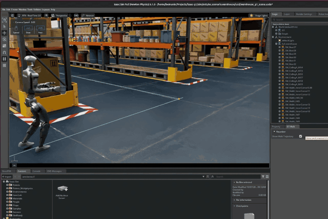
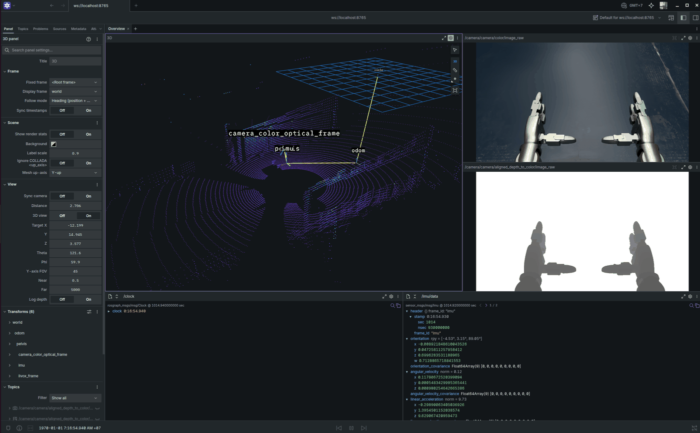

# isaac-g1

A Pixi-based Isaac Sim 6.1 project for the Unitree G1, built for agentic AI workflows.
Connects to ROS 2 Jazzy over the DDS implementation of your choice.



## Prerequisites

- [Pixi](https://pixi.sh)
- Linux (Ubuntu 22.04 / 24.04) or Windows
- An NVIDIA RTX GPU that meets [Isaac Sim's requirements](https://docs.isaacsim.omniverse.nvidia.com/latest/installation/requirements.html)
- A coding agent such as Claude Code (for setup and the project skills)
- [Foxglove](https://foxglove.dev) (optional, to view topics)

## Setup

1. Install Pixi and clone this repo.
2. Open a coding agent in the repo root and initialize the project:
   - Claude Code: type `/init`.
   - Codex: type `$oc-init-proj`.

This installs the Pixi environments and links the Isaac Sim package (`_isaacsim`)
(`.agents/skills/oc-init-proj/SKILL.md`).

> [!NOTE]
> - In Claude Code, `/init` follows `AGENTS.md`'s Init section: it sets up the project and does not
>   create a `CLAUDE.md`. Codex has no such hook, so run the skill directly.

## Getting started

Run the warehouse example to watch the G1 walk a loop through the hall, and inspect its topics in Foxglove.

1. Start the sim. Isaac Sim opens the warehouse and plays it; the G1 stands 2 s, then walks a loop
   through the hall.

   ```bash
   pixi run warehouse
   ```

2. In a second terminal, start the Foxglove bridge:

   ```bash
   pixi run foxglove
   ```

3. In Foxglove, open a connection to `ws://localhost:8765` to see the lidar, camera, TF and IMU
   topics.

The sim uses the session's DDS (`pixi run dds` shows it). If it is `zenoh`, start the router with
`pixi run zenoh` before steps 1 and 2. See [DDS](#dds) and [Warehouse](#warehouse) for the options.

## DDS

Pick the ROS 2 middleware once; new Pixi sessions use it.

| Command | Does |
| --- | --- |
| `pixi run dds [fast\|cyclone\|zenoh]` | Select the DDS (no argument shows the current one) |
| `pixi run zenoh` | Start the Zenoh router (needed for `zenoh`) |
| `pixi run shell` | Open a ROS 2 shell in `ros_ws` |
| `pixi run foxglove` | Start the Foxglove bridge on `ws://localhost:8765` |



## Warehouse

The warehouse example can run in many configurations, such as a different physics engine, workflow or headless mode:

```bash
pixi run warehouse                   # Standalone workflow, Newton, with a window
pixi run warehouse --workflow ext    # Extension workflow
pixi run warehouse --physics physx   # PhysX instead of Newton
pixi run warehouse --headless        # no window
```

`--dds fast|cyclone|zenoh` overrides the session's DDS. See
[`sim/exts/oc.scenario.warehouse`](sim/exts/oc.scenario.warehouse/docs/README.md).

## Control

`oc.control.g1_walk` makes a G1 follow a Walk trajectory with Unitree's walking Policy, correcting its
heading from the IMU and its position from the simulation. A Scenario starts a `G1Walker` and
hands it a trajectory generated by a `WalkPlan`; the warehouse's is in `warehouse_walk_trajectory.py`. Window > G1 Walk (tabbed next to Property) can show each G1's Walk trajectory. See [`sim/exts/oc.control.g1_walk`](sim/exts/oc.control.g1_walk/docs/README.md).

## Skills

Ask your coding agent to use these (in Claude Code, `/<name>`):

- `oc-init-proj`: install the Pixi envs and create the project symlinks; `/init` in Claude Code, `$oc-init-proj` in Codex.
- `oc-add-ext`: scaffold a new Isaac Sim extension.
- `oc-g1-ros`: add the G1 to a stage, work with its ROS 2 graphs, or add sensors.

The other skills in `.agents/skills/` are third-party Isaac Sim references. Agent rules live in
[`AGENTS.md`](AGENTS.md); project terms in [`GLOSSARY.md`](GLOSSARY.md).
